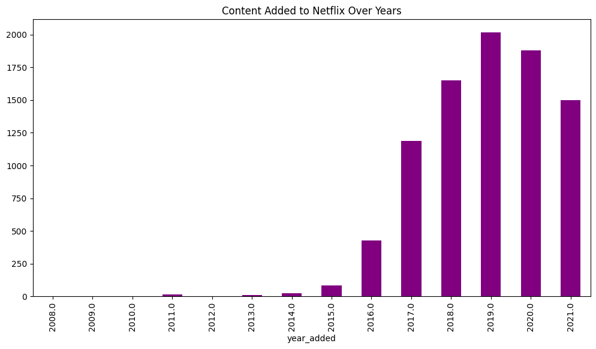
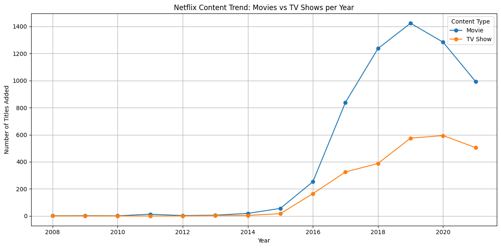
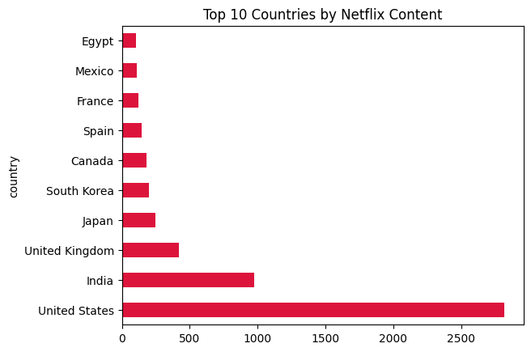

# 📺 Netflix Data Analysis Project

### 🔍 Overview
A deep dive into Netflix's content trends using real-world data. This project uncovers how Netflix has evolved over the years in terms of Movies vs TV Shows, content production by country, average durations, and more.

### 🧠 Objectives
- Clean messy real-world data
- Perform exploratory data analysis (EDA)
- Extract meaningful insights
- Visualize content trends with plots

### 📁 Dataset
- **Source**: [Netflix Dataset on Kaggle](https://www.kaggle.com/datasets/shivamb/netflix-shows)
- ~8,800 entries with features like `title`, `type`, `director`, `cast`, `country`, `date_added`, `duration`, etc.

### ⚙️ Tech Stack
| Tool        | Purpose                        |
|-------------|----------------------------------|
| Python      | Programming Language            |
| Pandas      | Data Analysis                   |
| NumPy       | Numerical Computation           |
| Matplotlib  | Data Visualization              |

### ⚙️ Key Steps
1. **Data Cleaning**
   - Converted `date_added` to datetime
   - Extracted `year_added`
   - Handled null values, standardized `duration` format

2. **Exploratory Data Analysis (EDA)**
   - Type distribution: Movies vs TV Shows
   - Top content-producing countries
   - Ratings and durations
   - Trends over years

3. **Visualizations**
   - Line plots for content trends by year
   - Bar charts for top countries
   - Pie chart for content types

#### 📷 Sample Visualizations

! [Top Genres](visualizations/sample-bar-plot2.png)

### 📈 Key Insights
- 🔺 Netflix saw a major content addition spike around 2017–2019
- 🎮 Movies dominate but 📺 TV Shows are increasing yearly
- 🇺🇸 USA produces the most Netflix content, with India & UK behind
- ⌛ Average movie duration: ~90 minutes

### 💡 What I Learned
- Cleaning irregular text data using regex
- Grouping & aggregating using `groupby()`
- Handling time-series data in Pandas
- Visualizing trends using Matplotlib
- Working with real-world dirty datasets

### 📌 Future Ideas
- Build dashboards with Plotly or Seaborn
- Compare content genres by popularity
- Analyze trends over time per country or rating

### 🔗 Connect with Me

  
  
  
  

---

> ⭐ *If you liked this project or found it helpful, consider giving it a star!*
